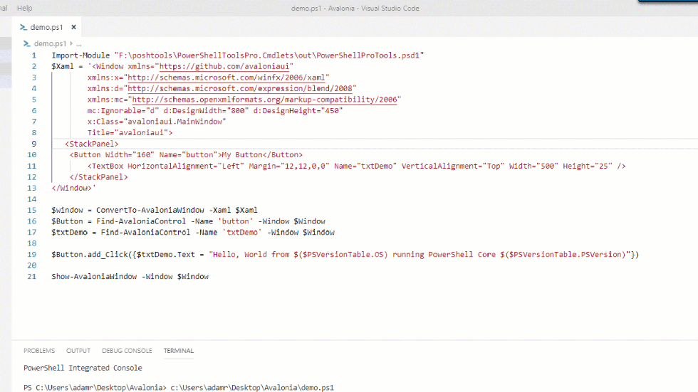

# PSAvalonia

[Avalonia](http://avaloniaui.net/) bindings for PowerShell

## Avalonia

[Avalonia is a WPF-style, cross-platform UI library](http://avaloniaui.net/). It works with .NET Core and on Linux, Windows and MacOS.

## Available Commands 

- Show-AvaloniaWindow
- ConvertTo-AvaloniaWindow
- Find-AvaloniaControl

## Example

```
$Xaml = '<Window xmlns="https://github.com/avaloniaui"
        xmlns:x="http://schemas.microsoft.com/winfx/2006/xaml"
        xmlns:d="http://schemas.microsoft.com/expression/blend/2008"
        xmlns:mc="http://schemas.openxmlformats.org/markup-compatibility/2006"
        mc:Ignorable="d" d:DesignWidth="800" d:DesignHeight="450"
        x:Class="avaloniaui.MainWindow"
        Title="avaloniaui">
   <StackPanel>
	<Button Width="160" Name="button">My Button</Button>
        <TextBox HorizontalAlignment="Left" Margin="12,12,0,0" Name="txtDemo" VerticalAlignment="Top" Width="500" Height="25" />
    </StackPanel>
</Window>'
$window = ConvertTo-AvaloniaWindow -Xaml $Xaml
$Button = Find-AvaloniaControl -Name 'button' -Window $Window
$txtDemo = Find-AvaloniaControl -Name 'txtDemo' -Window $Window
$Button.add_Click({$txtDemo.Text = "Hello, World from $($PSVersionTable.OS) running PowerShell Core $($PSVersionTable.PSVersion)"})
Show-AvaloniaWindow -Window $Window
```

_Script Running on Windows_



_Script Running on Linux_


## Supported PowerShell Versions

- 6.2 
- 7.0